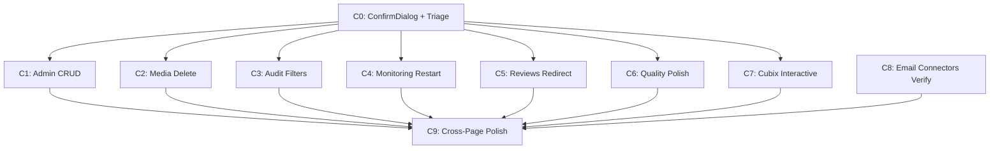

# Sprint C: UI Finomhangolas (v1.4.0)

> **Branch:** `feature/v1.4.0-ui-refinement` (from `main`)
> **Parent plan:** `01_PLAN/58_POST_SPRINT_HARDENING_PLAN.md`
> **Predecessor:** v1.3.0 (Sprint B COMPLETE, 2026-04-09)

## Context

After Sprint B, the admin UI has 23 pages but ~8 have broken or missing interactivity. The root cause: no Figma design was ever done — pages were coded ad-hoc without UX review. Buttons render but have no `onClick`, dialogs don't exist, and CRUD flows are incomplete. This sprint makes every visible UI control functional, adds missing CRUD dialogs, and writes E2E tests for each fixed page.

**All backend endpoints already exist** — this is purely a frontend sprint with E2E test additions.

## Rules
- 7 HARD GATE for UI work (Journey → API audit → Figma → Code → tsc → E2E → Review)
- Real testing only — Docker PostgreSQL, Redis, real API
- i18n: every new string via `translate()` + hu.json + en.json
- Untitled UI + Tailwind v4 — reuse existing components
- Conventional commit + Co-Authored-By

---

## Dependency Graph



All C1-C8 depend only on C0 (ConfirmDialog component). C1-C8 are parallelizable. C9 is the final sweep.

---

## C0 — ConfirmDialog + Triage (1 session)

**Goal:** Create reusable `ConfirmDialog` component + verify RED/YELLOW audit.

### Changes

**`aiflow-admin/src/components-new/ConfirmDialog.tsx`** (NEW)
- Props: `open`, `title`, `message`, `confirmLabel`, `variant` ("danger" | "default"), `loading`, `onConfirm`, `onCancel`
- Pattern: portal overlay, same structure as `ConnectorFormDialog` in `Emails.tsx:542-642`
- Dark mode support, `aria-label` on buttons

**`aiflow-admin/src/locales/hu.json`** + **`en.json`**
- Add keys for all C1-C8 new strings (dialog titles, button labels, warnings)

**Verify:** `npx tsc --noEmit` passes, ConfirmDialog renders in isolation.

---

## C1 — Admin.tsx: Full CRUD (2 sessions)

**Goal:** Wire all dead buttons — Add User, Generate Key, Revoke Key.

### Verified Backend Endpoints
- `POST /api/v1/admin/users` — `CreateUserRequest { email, name, role, password }` → `UserResponse` (`admin.py:199`)
- `POST /api/v1/admin/api-keys` — `CreateAPIKeyRequest { name, user_id? }` → `APIKeyCreatedResponse { id, name, key, prefix }` (`admin.py:299`)
- `DELETE /api/v1/admin/api-keys/{key_id}` — 204 No Content (`admin.py:331`)

### Changes to `aiflow-admin/src/pages-new/Admin.tsx`

Current state (`Admin.tsx:45`): actions button has NO onClick — just renders text.

1. **State additions:** `showCreateUser`, `showGenerateKey`, `showRevealKey` (string|null for the raw key), `actionLoading`
2. **Actions button onClick** (`Admin.tsx:45`): wire to `setShowCreateUser(true)` or `setShowGenerateKey(true)` based on `tab`
3. **CreateUserDialog** (inline component):
   - Form: email, name, password, role dropdown (viewer/admin)
   - `fetchApi("POST", "/api/v1/admin/users", ...)` → on success `ur()` (refetch users)
   - Password min 8 chars validation (matches backend `admin.py:201`)
4. **GenerateKeyDialog**:
   - Form: name input only
   - `fetchApi("POST", "/api/v1/admin/api-keys", { name })` → response contains `key` field (full key, shown ONCE)
   - After success: show **key reveal panel** — monospace `<code>` block + copy-to-clipboard button + warning banner "This key will not be shown again"
5. **Revoke Key button** per row in keys tab:
   - Add action column to `keyCols` array
   - Button → `ConfirmDialog` (variant="danger") → `fetchApi("DELETE", "/api/v1/admin/api-keys/${id}")` → `kr()` (refetch keys)

**Figma needed:** API key reveal UI (monospace code block + copy + warning)

### New E2E test: `tests/e2e/test_admin_crud.py`
- Create user → verify in list → Generate API key → verify prefix in list → Revoke key → verify removed

---

## C2 — Media.tsx: Delete + Bulk Delete (1 session)

**Goal:** Add per-row and bulk delete to media jobs table.

### Verified Backend Endpoint
- `DELETE /api/v1/media/{job_id}` — `DeleteResponse` (`media_processor.py:115`)

### Changes to `aiflow-admin/src/pages-new/Media.tsx`

1. **Action column** in DataTable columns:
   - Delete icon button → `ConfirmDialog` → `fetchApi("DELETE", "/api/v1/media/${id}")` → `refetch()`
2. **Enable DataTable selection**: add `selectable` + `onSelectionChange` (DataTable already supports — `DataTable.tsx:42-46`)
3. **Bulk delete bar**: when `selectedItems.length > 0`, show "Delete Selected (N)" button
   - Sequential delete calls (no bulk endpoint exists) → `refetch()`

### New E2E test: `tests/e2e/test_media_delete.py`

---

## C3 — Audit.tsx: Filters + Export (1 session)

**Goal:** Server-side filtering + CSV export for audit log.

### Verified Backend Endpoint
- `GET /api/v1/admin/audit?action=X&entity_type=Y&user_id=Z&limit=N` — all query params supported (`admin.py:117-131`)

### Changes to `aiflow-admin/src/pages-new/Audit.tsx`

Current state: static `useApi("/api/v1/admin/audit")` with no filters.

1. **State:** `filterAction`, `filterEntity`, `filterUser`, `limit`, `selectedEntry`
2. **Dynamic API path**: rebuild with query params when filters change
3. **Filter bar**: 3 dropdowns + limit selector (25/50/100/500)
4. **CSV Export** (button exists but no onClick): wire to Blob URL download (pattern from `Emails.tsx:160-169`)
5. **Detail modal**: onRowClick → show JSON details

### New E2E test: `tests/e2e/test_audit_filters.py`

---

## C4 — Monitoring.tsx: Service Restart + Auto-refresh (1 session)

**Goal:** Add restart button to service cards + auto-refresh interval.

### Verified Backend Endpoint
- `POST /api/v1/services/manager/{name}/restart` — `RestartServiceResponse` (`services.py:333`)

### Changes to `aiflow-admin/src/pages-new/Monitoring.tsx`

1. **State:** `restartingService` (string|null), `refreshInterval` (number|null)
2. **Auto-refresh**: `useApi` refetchInterval option (`hooks.ts:44-48`)
3. **Interval selector** in PageLayout actions: 10s/30s/60s/off
4. **Restart button** on each service card → `ConfirmDialog` → POST restart → refetch

### New E2E test: `tests/e2e/test_monitoring_restart.py`

---

## C5 — Reviews.tsx: Redirect to Documents (0.5 session)

**Goal:** Remove deprecated Reviews page, redirect to /documents.

### Changes

**`router.tsx:85`**: `{ path: "reviews", element: <Navigate to="/documents" replace /> }`
**`Sidebar.tsx`**: Remove Reviews item from "documentProcessing" group
**`Reviews.tsx`**: Keep file, replace with redirect wrapper

---

## C6 — Quality.tsx: Rubric Detail + KPI (1 session)

**Goal:** Make rubric table rows clickable, add rubric count KPI.

### Changes to `aiflow-admin/src/pages-new/Quality.tsx`

1. **Rubric count KPI** card
2. **Clickable rubric rows** → expand/detail panel
3. **Improve eval error feedback** — show actual API error
4. **External tools links** — configurable URLs (not hardcoded localhost)

---

## C7 — Cubix.tsx: Interactive Viewer (1.5 sessions)

**Goal:** Add search/filter, collapsible sections, pipeline trigger.

### Verified Backend
- `GET /api/v1/cubix` — `{ courses: CubixCourse[] }` (filesystem-based)
- `POST /api/v1/pipelines/templates/{name}/deploy` — exists (`pipelines.py:822`)

### Changes to `aiflow-admin/src/pages-new/Cubix.tsx`

1. **Search/filter**: text input, filter by `course_name`/`title`
2. **Collapsible sections**: reuse pattern from `Media.tsx:20-49` TranscriptSections
3. **Pipeline trigger**: "Run Cubix Pipeline" → ConfirmDialog → `fetchApi("POST", "/api/v1/pipelines/templates/cubix_course_capture/deploy")`
4. **Migrate to `useApi` hook** for consistency (replace manual useEffect)

**Figma needed:** Course card layout with expand/collapse + pipeline trigger

### New E2E test: `tests/e2e/test_cubix_viewer.py`

---

## C8 — Email Connectors: Live Verification (0.5 session)

**Goal:** Confirm Connectors CRUD works + write E2E test.

### Current State
ConnectorsTab in `Emails.tsx` (line 645) appears fully implemented:
- Create/Edit/Delete/Test/Fetch all wired
- **Note:** Delete uses `window.confirm()` (line 532) — optionally migrate to ConfirmDialog

### New E2E test: `tests/e2e/test_email_connectors.py`

---

## C9 — Cross-Page Polish + Finalization (1 session)

### Checklist
1. Dark mode: verify every modified page
2. `aria-label` on icon-only buttons
3. Console: 0 errors across all 23 pages
4. Dead buttons: audit every `<button>` has `onClick`
5. Full E2E suite (121 existing + 6 new = 127+)
6. `npx tsc --noEmit` + `ruff check` + `ruff format --check`
7. Update `CLAUDE.md` + `01_PLAN/58_POST_SPRINT_HARDENING_PLAN.md`

---

## Reusable Assets

| Asset | Location | Reuse In |
|-------|----------|----------|
| `DataTable` (sort, filter, select) | `components-new/DataTable.tsx` | C2, C3 |
| `ConnectorFormDialog` pattern | `Emails.tsx:542-642` | C0 (ConfirmDialog) |
| `TranscriptSections` collapse | `Media.tsx:20-49` | C7 (Cubix) |
| `useApi` with refetchInterval | `lib/hooks.ts:44-48` | C4 |
| `fetchApi` typed wrapper | `lib/api-client.ts` | All |
| CSV export (Blob URL) | `Emails.tsx:160-169` | C3 |

---

## Schedule

```
C0: ConfirmDialog + triage           1 session
C1: Admin CRUD                       2 sessions  [Figma: key reveal]
C7: Cubix interactive                1.5 sessions [Figma: card layout]
C2: Media delete                     1 session    ── parallelizable ──
C3: Audit filters + export           1 session    ── with C4, C5, C6 ──
C4: Monitoring restart               1 session
C5: Reviews redirect                 0.5 session
C6: Quality polish                   1 session
C8: Email connectors verify          0.5 session
C9: Cross-page polish                1 session
                                    ─────────────
Total:                              ~10.5 sessions
```

**Figma needed:** 2 pages (C1 key reveal, C7 Cubix cards)
**New E2E tests:** 6 files (admin, media, audit, monitoring, cubix, connectors)
**New component:** 1 (`ConfirmDialog.tsx`)
**Backend changes:** 0

---

## Success Criteria

| # | Criterion | Metric |
|---|-----------|--------|
| 1 | 0 dead buttons | Every `<button>` has `onClick` — manual audit |
| 2 | Admin CRUD | Create user + Generate key + Revoke key E2E PASS |
| 3 | Media delete | Upload + delete E2E PASS |
| 4 | Audit filters | Filter + export CSV E2E PASS |
| 5 | Monitoring restart | Service restart works E2E PASS |
| 6 | Reviews gone | Redirect works, sidebar clean |
| 7 | Cubix interactive | Search + sections + pipeline trigger E2E PASS |
| 8 | Email Connectors | CRUD E2E PASS |
| 9 | Dark mode | All modified pages render |
| 10 | tsc + ruff | 0 errors |
| 11 | E2E suite | Full suite PASS (127+ tests) |

## Verification

```bash
# Per-phase gate
cd aiflow-admin && npx tsc --noEmit
cd .. && make lint

# E2E (requires running services)
make api &
cd aiflow-admin && npm run dev &
pytest tests/e2e/ -v --timeout=60

# Final regression
pytest tests/unit/ -v
pytest tests/e2e/ -v
```
